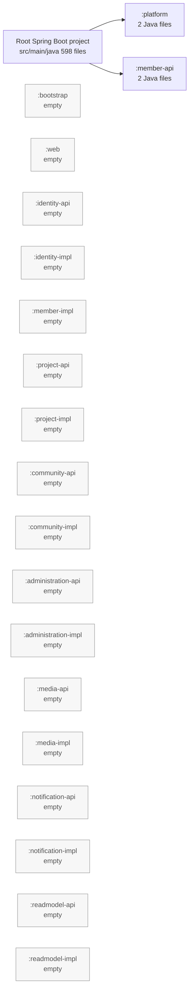

# DevHub 모듈러 모놀리스 물리적 모듈화 감사

## 1. 감사 범위와 판단 기준

이 문서는 현재 작업 트리의 Gradle 설정과 Java 소스 파일을 읽어 수행한 **읽기 전용 감사** 결과이다. 생산 코드, Gradle 설정, 기존 마이그레이션 문서는 변경하지 않았으며, 이 문서만 추가한다.

감사 대상 문서는 `codex/`의 다음 다섯 파일이다.

- `MONOLITH_TO_MSA_ANALYSIS.md`
- `MODULAR_MONOLITH_MIGRATION_PLAN.md`
- `ARCHITECTURE_RULES.md`
- `DOMAIN_OWNERSHIP.md`
- `MIGRATION_PROGRESS.md`

중요한 문서 상태도 구분할 필요가 있다. `MONOLITH_TO_MSA_ANALYSIS.md`와 `MIGRATION_PROGRESS.md`에는 실제 분석 및 수행 이력이 있다. 반면 `MODULAR_MONOLITH_MIGRATION_PLAN.md`, `ARCHITECTURE_RULES.md`, `DOMAIN_OWNERSHIP.md`는 현재 승인된 세부 계획/규칙/소유권 표가 아니라 작업 지시문 성격의 내용이다. 따라서 이 감사의 소유권 분류는 우선 실제 패키지, 클래스, 어댑터 및 이전 분석 문서의 근거에 따른 **감사 권고**이며, 아직 기계적으로 강제되는 공식 소유권 규칙은 아니다.

### 판정 기준

이 감사에서 “물리적으로 모듈화됨”은 다음을 모두 뜻한다.

1. 해당 Gradle 프로젝트가 존재한다.
2. 해당 프로젝트의 `src/main/java`에 그 컨텍스트가 소유하는 실제 생산 `.java` 코드가 있다.
3. 다른 컨텍스트가 그 구현이 아니라 공개 API 프로젝트에만 의존하도록 Gradle 의존성이 표현된다.

`build.gradle`만 존재하거나, 루트 `src/main/java`의 패키지 이름만 논리적으로 분류된 경우는 물리적 모듈화가 아니다.

## 2. 결론 요약

현재 저장소는 **Gradle 멀티 프로젝트 골격**을 갖고 있으나, 아직 각 바운디드 컨텍스트가 소스를 물리적으로 소유하는 모듈러 모놀리스는 아니다.

- `settings.gradle`에는 `bootstrap`, `platform`, `web` 및 여덟 컨텍스트의 `-api`/`-impl` 프로젝트, 총 19개 하위 프로젝트가 포함되어 있다.
- 루트 `src/main/java`에는 생산 Java 파일 **598개**, 루트 `src/test/java`에는 테스트 Java 파일 **209개**가 있다.
- 하위 프로젝트 중 실제 생산 Java 파일이 있는 곳은 `platform`의 2개 파일과 `member-api`의 2개 파일뿐이다.
- `member-api`의 `MemberPublicProfile`, `MemberPublicProfileQuery`는 의미 있는 공개 계약의 첫 사례이지만, 이를 구현하는 `UserProfileService`와 Member의 도메인/영속 코드는 여전히 루트에 있다.
- `platform`의 `IdentifierProvider`, `SystemIdentifierProvider`는 실제로 물리 이동되었으나 `TimeProvider`, JPA 공통 기반, 공통 예외 등 다수의 기술 공통 코드는 루트에 남아 있다.
- Root project만 Spring Boot 애플리케이션을 조립하고 있으며, Root가 `:platform`, `:member-api`에만 의존한다. 나머지 API/구현 프로젝트는 Gradle 수준에서 아무 코드도 제공하거나 소비하지 않는다.

따라서 현재 경계의 대부분은 `teamdevhub.devhub.core.*`, `outbound.*`, `api.*`라는 **패키지 관례**일 뿐, Java 컴파일러와 Gradle이 위반을 막는 **컴파일 타임 경계가 아니다**.

## 3. 현재 물리 구조와 목표 구조

### 현재 구조

```text
devhub-b/
├── build.gradle                    # Spring Boot 실행/모든 기존 의존성/루트 소스셋
├── settings.gradle                 # 19개 하위 프로젝트 include
├── src/main/java/teamdevhub/devhub # 생산 Java 598개: 대부분의 실제 애플리케이션
├── src/test/java/teamdevhub/devhub # 테스트 Java 209개: 모든 기존 테스트
├── platform/
│   └── src/main/java/.../platform/identifier/  # 2개 파일
├── member-api/
│   └── src/main/java/.../member/api/profile/  # 2개 파일
└── 나머지 17개 하위 프로젝트
    └── build.gradle만 존재, src/main/java 없음
```

`build.gradle`의 프로젝트 의존성은 다음 두 개뿐이다.

```text
root Spring Boot project --> :platform
root Spring Boot project --> :member-api
```

`bootstrap`은 현재 Spring Boot 실행 모듈이 아니다. Spring Boot 플러그인과 `DevhubApplication`은 아직 루트에 있다.

### 기대 구조

현재 `settings.gradle`이 채택한 API/구현 분리 방식을 유지한다면, 목표는 단일 `identity/` 폴더가 아니라 다음처럼 **컨텍스트별 공개 계약과 구현 소스가 실제로 분리**된 형태가 된다.

```text
identity-api/src/main/java/.../identity/api/...
identity-impl/src/main/java/.../identity/{core,outbound}/...
member-api/src/main/java/.../member/api/...
member-impl/src/main/java/.../member/{core,outbound}/...
project-api/src/main/java/.../project/api/...
project-impl/src/main/java/.../project/{core,outbound}/...
...
web/src/main/java/.../web/...          # REST controller/HTTP DTO/웹 어댑터
platform/src/main/java/.../platform/... # 기술 공통 코드
bootstrap/src/main/java/.../bootstrap/... # 단일 Spring Boot 조립과 설정
```

각 `*-impl` 내부에서는 기존 헥사고날 구성을 보존해 `core`(도메인, 애플리케이션, 포트)와 `outbound`(JPA, QueryDSL, 외부 연동 어댑터)를 함께 둔다. 외부 컨텍스트에는 `*-api`의 의미 있는 use case/query/result만 공개한다. JPA Entity, Spring Data Repository, QueryDSL DAO, mapper, adapter 구현은 `*-impl` 밖으로 나가면 안 된다.

## 4. 모듈별 감사 결과

아래 표의 “루트 잔존 생산 코드”는 파일 전부를 한 줄씩 나열하기보다, 실제 소유 단위가 드러나는 패키지와 대표 클래스를 표시한다. 표에 적힌 `outbound/**/adapter/entity`, `persistence`는 모두 JPA Entity/Repository 또는 QueryDSL 구현을 포함하는 경로이다.

| 논리 컨텍스트 / 실제 Gradle 프로젝트 | 프로젝트 및 생산 소스 상태 | 자체 테스트 상태 | 루트에 남은 소유 생산 코드 | 루트에 남은 영속 코드 | 루트에 남은 컨트롤러/HTTP 코드 | 현재 Gradle 강제 경계 |
|---|---|---|---|---|---|---|
| Identity (`identity-api`, `identity-impl`) | 둘 다 존재. 둘 다 `src/main/java` 없음, 생산 파일 0개 | 둘 다 `src/test/java` 없음, 테스트 0개 | `core/auth/**` (`AuthenticationService`, `OAuthAuthenticationService`, `VerificationService`, credential/verification/token 포트), `outbound/auth/**`, `outbound/security/**` | `outbound/auth/adapter/entity/{EmailCredentialEntity,OAuthCredentialEntity,RefreshTokenEntity,VerificationEntity}`, `JpaEmailCredentialRepository`, `JpaOAuthCredentialRepository`, `JpaRefreshTokenRepository`, `JpaVerificationRepository` | `api/auth/**`: `AuthController`, `OAuthController`, `VerificationController`, `CookieFactory` 및 HTTP DTO | 없음. Root 내부 패키지 관례만 존재 |
| Member (`member-api`, `member-impl`) | 둘 다 존재. `member-api`만 `src/main/java` 존재, `MemberPublicProfile`, `MemberPublicProfileQuery` 2개. `member-impl`은 생산 파일 0개 | 둘 다 자체 테스트 없음 | `core/user/**` 44개: `User`, `UserReview`, `UserProfileService`, `UserSignupService`, `AdminUserManagementService` 등 | `outbound/user/**`: `UserEntity`, `UserPositionEntity`, `UserReviewEntity`, `UserSkillEntity`, `JpaUserRepository` 등 | `api/user/**`: `UserProfileController`, `UserSignupController`, `AdminUserController` 및 DTO | Root → `:member-api`만 강제. `member-impl` 경계 없음 |
| Project (`project-api`, `project-impl`) | 둘 다 존재. 둘 다 `src/main/java` 없음, 생산 파일 0개 | 둘 다 자체 테스트 없음 | `core/project/**` 36개와 `core/application/**` 22개. 즉 Marketplace와 Recruitment Application의 `Project`, `ProjectApplication`, 관련 서비스/포트가 함께 루트에 있음 | `outbound/project/**`: `ProjectEntity`, `ProjectLikeEntity`, `ProjectRequirementEntity`, `ProjectSkillEntity`, JPA repository/QueryDAO. `outbound/application/**`: `ProjectApplicationEntity`, `ProjectApplicationAnswerEntity`, `ProjectApplicationFormEntity`, JPA repository/QueryDAO | `api/project/**`, `api/application/**`: `ProjectController`, `AdminProjectController`, `ProjectMemberReviewController`, `ApplicationController`, 두 종류의 `ApplicationFormController` 및 DTO | 없음. Marketplace와 Recruitment를 같은 프로젝트로 묶는 Gradle 경계도 아직 없음 |
| Community (`community-api`, `community-impl`) | 둘 다 존재. 둘 다 `src/main/java` 없음, 생산 파일 0개 | 둘 다 자체 테스트 없음 | `core/board/**` 27개 (`Board`, `Comment`, `BoardService`, `CommentService` 등), `core/report/**` 9개 (`Report`, `ReportService` 등) | `outbound/board/**`: `BoardEntity`, `CommentEntity`, `BoardLikeEntity`, `JpaBoardRepository` 등. `outbound/report/**`: `ReportEntity`, `JpaReportRepository`, Query adapter | `api/board/**`, `api/report/**`, 그리고 운영용 `api/admin/board/**` | 없음. Phase 4의 `CommentService → MemberPublicProfileQuery`는 Root 내부 호출이므로 `community-impl → member-api`로 아직 강제되지 않음 |
| Administration (`administration-api`, `administration-impl`) | 둘 다 존재. 둘 다 `src/main/java` 없음, 생산 파일 0개 | 둘 다 자체 테스트 없음 | `core/admin/{banner,code,form}/**` 30개, `core/terms/**` 11개 | `outbound/admin/{banner,code,form}/**`: banner/code/form Entity, JPA repository, QueryDAO. `outbound/terms/**`: `TermsEntity`, `TermsAgreementEntity`, JPA repository | `api/admin/{banner,code,form}/**`, `api/terms/**`. 단, `api/user/AdminUserController`는 Member 관리 기능이므로 Member 소유으로 보는 것이 더 타당 | 없음 |
| Media (`media-api`, `media-impl`) | 둘 다 존재. 둘 다 `src/main/java` 없음, 생산 파일 0개 | 둘 다 자체 테스트 없음 | `core/file/**`: `FileService`, `FileMetadata`, `FileResource`, `FileStorage`/`FileMetadataRepository` 포트 | `outbound/file/**`: `FileEntity`, `JpaFileRepository`, `FileMetadataAdapter`, `LocalFileStorage`, `FileStorageProperties` | `api/file/**`: `FileController`, `FileResponseFactory`, `UploadFileRequestDto` | 없음 |
| Notification (`notification-api`, `notification-impl`) | 둘 다 존재. 둘 다 `src/main/java` 없음, 생산 파일 0개 | 둘 다 자체 테스트 없음 | `core/notification/**`: `Notification`, `NotificationService`, `NotificationQueryService`, `NotificationSender` 포트 | `outbound/notification/**`: `NotificationEntity`, `JpaNotificationRepository`, `NotificationAdapter`, `EmailNotificationSendAdapter` | `api/notification/NotificationController` | 없음 |
| Readmodel (`readmodel-api`, `readmodel-impl`) | 둘 다 존재. 둘 다 `src/main/java` 없음, 생산 파일 0개 | 둘 다 자체 테스트 없음 | `core/home/**` 11개, `core/skilltrend/**` 15개. 홈 조합 조회와 기술 동향 분석 조회가 루트에 있음 | `outbound/home/**`: `HomeBanner/Board/ProjectQueryDao(Impl)`과 adapter. `outbound/skilltrend/**`: `SkillTrendQueryDao(Impl)`과 adapter | `api/home/**`, `api/skilltrend/**` | 없음. 다른 도메인 테이블을 읽는 QueryDSL 조회도 Root에서 자유롭게 접근 가능 |
| Platform (`platform`) | 존재. `src/main/java` 존재, 생산 파일 2개: `platform/identifier/IdentifierProvider`, `SystemIdentifierProvider` | `src/test/java` 없음, 테스트 0개 | 기술 공통으로 후보인 `core/common/**` 6개 (`TimeProvider`, `AuditInfo`, page, domain exception), `outbound/common/**` 9개 (`SystemTimeProvider`, `BaseEntity`, JPA audit/converter, adapter exception), `shared/logging/**`, 일부 `shared/util/**` | `outbound/common/persistence/jpa/{audit,converter}/**`는 모든 JPA adapter의 기반이나 현재 Root에 있음 | 웹 예외 변환은 `shared/exception/GlobalExceptionHandler`에 남음 | Root → `:platform`만 강제. `platform`은 `spring-context`에 직접 의존. Root 잔존 공통 코드는 경계 밖 |
| Bootstrap (`bootstrap`) | 존재. `src/main/java` 없음, 생산 파일 0개 | `src/test/java` 없음, 테스트 0개 | `DevhubApplication.java`, 단일 애플리케이션 조립 후보인 `shared/config/{PasswordCryptoConfig,QueryDslConfig,SwaggerConfig,WebClientConfig,WebConfig,WebSecurityConfig}` | 별도 소유 Entity/Repository 없음. `QueryDslConfig`는 공통 인프라 조립 책임 | 없음. `SwaggerConfig`/`WebConfig`는 web과 연관되지만 부트스트랩 조립에서 등록 가능 | 없음. Root가 실질 bootstrap이며 `bootstrap`은 비어 있음 |
| Web (`web`) | 존재. `src/main/java` 없음, 생산 파일 0개 | `src/test/java` 없음, 테스트 0개 | 모든 `api/**` HTTP adapter. 공통 웹은 `api/web/**` (`CommonController`, `PageRequestDto`, `DataApiResponseDto`, `LoginUserArgumentResolver`, validator) | 소유 Entity/Repository 없음 | 모든 REST controller가 Root에 남아 있음. 컨텍스트별 controller와 request/response DTO도 모두 여기에 있음 | 없음. Root만 Spring MVC/Spring Boot 의존성을 보유 |

### 모듈별 의미

`platform`과 `member-api`만 “빈 skeleton이 아니다”라고 말할 수 있다. 그러나 `platform`은 일부 기술 추상화만 옮긴 상태이고, `member-api`는 한 공개 query 계약만 옮긴 상태이다. 둘 다 자신이 대표하는 전체 책임을 물리적으로 소유하지 않는다. 나머지 컨텍스트는 Gradle 프로젝트 이름과 `java-library` 플러그인만 있으며, Java source set 자체가 없다.

## 5. 루트 소스 트리 소유권 분류

루트 `src/main/java/teamdevhub/devhub`는 단일 Root source set으로 컴파일된다. 따라서 다음 분류는 현재 물리 소유가 아니라, 후속 물리 이동의 후보 분류이다.

| 루트 패키지/클래스군 | 권고 대상 | 근거 및 주의점 |
|---|---|---|
| `core/auth/**`, `outbound/auth/**`, `outbound/security/**` | identity | 인증, OAuth, JWT, credential, verification 및 Spring Security adapter가 응집되어 있다. `WebSecurityConfig`의 필터 등록은 bootstrap 조립 책임으로 남길 수 있으나 filter/provider 구현은 Identity 구현에 둔다. |
| `api/auth/**` | web | REST controller/쿠키/HTTP DTO이므로 Identity의 공개 use case에 의존하는 web inbound adapter로 둔다. HTTP DTO를 `identity-api`로 옮기지 않는다. |
| `core/user/**`, `outbound/user/**` | member | 사용자 프로필, 가입, 상태, 직책, 기술, 리뷰와 `UserEntity` 계열, repository/QueryDSL 구현이 같은 책임이다. |
| `api/user/**` | web | `UserProfileController`, `UserSignupController`, DTO는 web으로 간다. `AdminUserController`도 운영 화면이지만 실제 사용자 변경 use case를 호출하므로 Member web adapter로 분류한다. |
| `core/project/**`, `outbound/project/**` | project | 프로젝트, 좋아요, 요구사항, skill, member 참여, project QueryDSL 조회가 여기에 있다. |
| `core/application/**`, `outbound/application/**` | project | `ProjectApplication`, 지원서/답변/지원서 양식 및 repository는 프로젝트 모집 lifecycle에 결합되어 있다. 현재 계획대로 Marketplace와 Recruitment Application을 별도 Gradle 모듈로 나누지 않는다. |
| `api/project/**`, `api/application/**` | web | Project/Application REST controller 및 request/response DTO이다. 운영용 project/application endpoint도 web 하위의 project adapter로 둔다. |
| `core/board/**`, `outbound/board/**`, `core/report/**`, `outbound/report/**` | community | 게시글, 댓글, 좋아요, 신고와 영속 adapter가 Community 책임이다. |
| `api/board/**`, `api/report/**`, `api/admin/board/**` | web | 운영 게시판 endpoint를 포함한 HTTP 어댑터이다. 업무 소유는 Community지만 web 모듈에서 Community 공개 use case를 호출한다. |
| `core/admin/**`, `outbound/admin/**`, `core/terms/**`, `outbound/terms/**` | administration | 배너, 공통 코드, 모집 양식, 약관 및 해당 Entity/Repository/QueryDSL 구현이 관리/정책 기능으로 응집되어 있다. |
| `api/admin/{banner,code,form}/**`, `api/terms/**` | web | HTTP adapter로 web에 두고 Administration 공개 use case에 의존시킨다. |
| `core/file/**`, `outbound/file/**` | media | 파일 메타데이터, 로컬 저장소, `FileEntity`, `JpaFileRepository`가 한 기능이다. 다른 컨텍스트에는 `FileMetadata`/식별자 같은 최소 계약만 공개해야 한다. |
| `api/file/**` | web | 파일 업로드 REST adapter와 DTO/factory이다. |
| `core/notification/**`, `outbound/notification/**` | notification | 알림 저장/조회와 이메일 발송 adapter가 여기에 있다. 단, 인증 코드 이메일의 선택/발행 규칙은 `core/auth`에 있으므로 알림 모듈이 Identity 도메인을 흡수해서는 안 된다. |
| `api/notification/**` | web | 알림 REST controller이다. |
| `core/home/**`, `outbound/home/**`, `core/skilltrend/**`, `outbound/skilltrend/**` | readmodel | 홈 화면 조합 및 통계/동향 읽기 모델이다. 이 adapter들은 Banner/Board/Project 데이터를 조인/조회하므로 원본 write 모델의 소유권을 가져서는 안 된다. |
| `api/home/**`, `api/skilltrend/**` | web | 조회 REST adapter이다. |
| `core/common/**`, `outbound/common/**` | platform 또는 소유 컨텍스트 재귀속 | `TimeProvider`/`SystemTimeProvider`, 공통 audit/converter, 기술 예외는 platform 후보이다. `PageCommand`/`PageResult`, `AuditInfo`, `RelationChangeUtil`은 실제 사용처를 확인해 platform으로 최소화하거나 각 소유 컨텍스트로 되돌려야 한다. 무비판적 `common` 모듈 승격은 금지한다. |
| `shared/logging/**`, `shared/util/StringUtil.java` | platform (검증 후) | `LoggingAspect`, `TraceIdMDCFilter`는 관측성 기술 코드이다. `StringUtil`은 사용처가 다수일 경우 platform, 특정 컨텍스트 전용이면 그 컨텍스트에 둔다. |
| `shared/exception/GlobalExceptionHandler`, `api/web/**` | web | HTTP 오류 응답 변환, argument resolver, validation, 공통 응답 DTO는 web 책임이다. 도메인 예외 타입 자체는 platform 또는 각 컨텍스트에 남긴다. |
| `shared/config/{PasswordCryptoConfig,QueryDslConfig,SwaggerConfig,WebClientConfig,WebConfig,WebSecurityConfig}` | bootstrap (일부 web/identity 구현 등록) | Spring bean 조립과 애플리케이션 설정은 bootstrap에 둔다. 다만 `WebSecurityConfig`가 의존하는 filter/provider 구현은 identity-impl, `WebConfig`의 resolver는 web에 소유시키고 bootstrap은 조립만 해야 한다. |
| `shared/enums/**` | 소유 컨텍스트 재귀속 또는 검토 필요 | `ProjectApprovalStatus`, `ProjectRecruitStatus`는 project, `UserStatus`는 member, `VerificationProvider`는 identity, `NotificationType`은 notification, `ApplicationFormType`은 administration의 강한 후보이다. `ErrorCode`, `SuccessCode`, `DateConstants`는 전역 사용 여부를 검증해야 하므로 현재는 명확하지 않다. |
| `DevhubApplication.java` | bootstrap | 단일 Spring Boot 프로세스의 진입점/컴포넌트 조립 책임이다. |
| 루트에 합법적으로 남을 생산 Java | 없음(목표 상태) | 목표 구조에서는 Root는 Gradle 설정, wrapper, 공통 리소스 조정만 담당한다. `src/main/java`에 업무 생산 코드를 남길 필요가 없다. |

## 6. 데이터/영속 소스의 물리적 잔존 상태

모든 JPA Entity, Spring Data Repository, QueryDSL DAO와 persistence adapter는 아직 Root source set에 있다. 이는 데이터베이스가 하나라는 사실과 별개로, 컨텍스트의 구현 은닉이 아직 이루어지지 않았다는 뜻이다.

| 소유 후보 | 루트에 남은 Entity/Repository 대표 경로 | 감사 판정 |
|---|---|---|
| Identity | `outbound/auth/adapter/entity/**`, `outbound/auth/persistence/**` | 전량 Root. `identity-impl`로의 물리 이동 미수행 |
| Member | `outbound/user/adapter/entity/**`, `outbound/user/persistence/**`, `UserQueryDaoImpl` | 전량 Root. `member-api`의 공개 query와 구현이 분리되지 않음 |
| Project | `outbound/project/**`, `outbound/application/**` | 전량 Root. Marketplace/Recruitment persistence도 같은 향후 `project-impl`으로 이동해야 함 |
| Community | `outbound/board/**`, `outbound/report/**` | 전량 Root |
| Administration | `outbound/admin/**`, `outbound/terms/**` | 전량 Root |
| Media | `outbound/file/**` | 전량 Root |
| Notification | `outbound/notification/**` | 전량 Root |
| Readmodel | `outbound/home/**`, `outbound/skilltrend/**` | 전량 Root. 특히 다른 도메인 테이블을 읽는 QueryDSL 조회를 Readmodel 구현 내부로 한정할 필요가 있음 |
| Platform | `outbound/common/persistence/jpa/**` | 전량 Root. 공유 JPA 기반 타입의 진정한 소유/노출 범위를 먼저 확인해야 함 |

따라서 지금은 “논리적 데이터 소유”가 있을 뿐, Gradle의 소스 위치나 module dependency가 repository/Entity 접근을 차단하지 못한다. `community`가 Member repository에 접근하지 않는다는 보장은 클래스 규율과 테스트에만 의존한다.

## 7. 실제 Gradle 경계와 패키지 관례 경계

### 현재 Gradle이 실제로 강제하는 것



`Root → :platform`, `Root → :member-api` 외의 `project(':...')` 선언은 없다. 각 빈 하위 프로젝트에는 `java-library`와 Java 17 toolchain만 정의되어 있어, 상호 의존 규칙도 없다. `platform`만 `spring-context:6.2.12`를 직접 선언한다.

### 패키지 관례에만 머무는 경계

다음 경계는 코드가 동일한 Root source set에서 함께 컴파일되므로 compile-time boundary가 아니다.

- `core.auth` 대 `core.user`, `core.project`, `core.board` 등 모든 도메인 패키지 간 경계
- `core.*`와 `outbound.*` 간의 헥사고날 계층 경계
- 모든 `outbound/**/adapter/entity`, `persistence`, QueryDSL DAO의 컨텍스트별 은닉
- REST `api/**`와 도메인 use case 사이의 모듈 경계
- Phase 4에서 도입한 `MemberPublicProfileQuery`의 소비자와 Member 구현 간 경계
- Spring Security/JWT/OAuth 구현과 애플리케이션 조립 코드 간 경계

즉 현재 패키지 이름은 설계 의도를 보여 주지만, 다른 패키지에서 internal class, JPA Entity, repository, mapper를 import하는 것을 Gradle이 막지 않는다.

## 8. 목표 대비 갭 분석

| 목표 | 현재 사실 | 갭 | 영향 |
|---|---|---|---|
| 각 컨텍스트가 자신의 `src/main/java`를 가진다 | 19개 하위 프로젝트 중 17개는 생산 source directory가 없고, `platform`/`member-api`만 2개 파일씩 보유 | 596개 이상의 업무/인프라 생산 코드가 여전히 Root source set에 있음 | 컨텍스트 별 컴파일/테스트/의존성 검증이 불가능 |
| 구현은 `*-impl`, 공개 계약은 `*-api`에 숨긴다 | `member-api`만 공개 계약 2개. 모든 repository/entity/adapter는 Root | 구현 은닉이 없음 | 직접 영속 접근과 adapter 누수가 빌드 단계에서 탐지되지 않음 |
| `bootstrap`이 단일 Spring Boot 프로세스를 조립한다 | Root가 Spring Boot plugin, `DevhubApplication`, 전체 dependency를 보유 | 빈 `bootstrap` 프로젝트가 실제 실행 모듈과 분리됨 | 이후 모듈 이동 중 component scan/bean 조립 책임이 불명확해질 위험 |
| `web`이 HTTP adapter를 소유한다 | 모든 controller/HTTP DTO/exception handler가 Root `api/**`와 `shared/exception`에 존재 | `web`은 빈 skeleton | REST contract 보존을 검증할 독립 web 경계가 없음 |
| JPA/QueryDSL 구현은 소유 컨텍스트 안에 감춘다 | 모든 Entity/repository/DAO가 Root `outbound/**`에 존재 | 물리적 소유와 공개 surface가 불일치 | 향후 `*-impl` 의존을 우회하는 임시 import가 쉬움 |
| 테스트가 소유 모듈과 함께 이동한다 | 테스트 209개가 전부 Root `src/test/java`에 있음 | 모듈별 테스트 책임이 없음 | 모듈 이동 후 회귀 범위를 식별하기 어렵고 Root 테스트만 계속 비대해짐 |

## 9. 권고하는 물리적 마이그레이션 순서

이 절은 현재 감사 결과에 따른 권고이며, 이 감사에서 실행하지 않는다. 한 단계는 한 컨텍스트 전체를 한 번에 옮기라는 뜻이 아니라, 컴파일 가능한 작은 migration unit으로 나누어야 한다.

1. **소유권 문서와 Gradle 규칙을 실제 규칙으로 확정한다.** 현재 `DOMAIN_OWNERSHIP.md`와 `ARCHITECTURE_RULES.md`가 실행 가능한 기준이 아니므로, 먼저 이 감사의 후보를 검토해 소유/공개 API/금지 의존성을 표로 승인해야 한다. 그렇지 않으면 다음 이동에서 “컴파일을 위해 impl을 참조”하는 우회가 발생한다.
2. **`platform`의 남은 최소 기술 공통 코드를 완료한다.** 이미 이동한 `IdentifierProvider`, `SystemIdentifierProvider`를 보존하고, 다음 작은 단위로 `TimeProvider`/`SystemTimeProvider`처럼 명확한 기술 추상화만 옮긴다. `BaseEntity`, 공통 오류 코드, pagination은 사용처 분석 후에만 이동/재귀속한다.
3. **Member 공개 계약과 구현을 연결한다.** `member-api`의 `MemberPublicProfileQuery`를 보존한 채 `core/user/**`, `outbound/user/**`를 `member-impl`로 소규모 이동한다. 이때 Community는 훗날 `community-impl → member-api`만 보게 되어야 한다.
4. **Media를 작은 독립 구현 단위로 이동한다.** `core/file/**`, `outbound/file/**` 및 관련 테스트를 `media-impl`로 옮기고, 파일 REST adapter는 나중에 web으로 옮긴다. 외부 저장소와 파일 메타데이터 책임이 비교적 응집되어 있어 실전 물리 이동을 학습하기 좋은 단위다.
5. **Administration을 banner/code/form/terms 단위로 이동한다.** `admin`과 `terms`를 하나의 Administration 컨텍스트로 유지하되, `AdminUserController`/Member 사용자 변경을 섞지 않는다.
6. **Project를 Marketplace와 Recruitment Application을 함께 유지한 채 이동한다.** `core/project`와 `core/application`, 그리고 두 `outbound` 트리를 같은 `project-impl`로 옮긴다. 지원서 lifecycle을 별도 서비스/모듈로 앞서 분리하면 현재 Entity, QueryDSL, transaction 결합을 그대로 분산시키게 된다.
7. **Community를 Member 공개 계약에만 의존하도록 확인한 뒤 이동한다.** `CommentService`의 Phase 4 변경을 활용하되, 남은 auth/user/repository 직접 접근이 있다면 먼저 의미 있는 `*-api` 계약으로 교체한다.
8. **Identity와 보안 조립을 분리하여 이동한다.** JWT/OAuth/security adapter는 `identity-impl`, HTTP/bean 등록은 web/bootstrap의 역할로 구분한다. 이 단계는 Spring Security의 bean wiring과 인증 전파 영향이 크므로 앞 단계의 Gradle 관례가 검증된 후 수행한다.
9. **Notification과 Readmodel을 후순위로 이동한다.** Notification은 인증 verification 이메일과의 경계를 먼저 명확히 해야 한다. Readmodel은 여러 소유 테이블을 QueryDSL로 읽으므로 원본 모델의 공개 조회 계약 또는 명시적 read adapter 정책이 없으면 물리 이동해도 결합이 숨겨질 뿐이다.
10. **마지막에 web/bootstrap을 실제 실행/조립 모듈로 전환한다.** 모든 controller/DTO를 `web`, `DevhubApplication`과 `@Configuration` 조립 책임을 `bootstrap`으로 옮긴다. 여전히 하나의 H2 In-Memory DB와 하나의 Spring Boot process를 유지한다.

각 이동 직후에는 해당 `*-impl`의 JPA Entity/repository/QueryDSL/adapter가 다른 프로젝트에 노출되지 않는지, 소비자가 `*-api`에만 의존하는지, 루트 source set이 줄었는지를 확인해야 한다. 빈 하위 프로젝트를 먼저 더 만드는 것은 이 갭을 줄이지 않는다.

## 10. Phase 3/4 작업의 처리 권고

### Phase 3: `IdentifierProvider` 물리 이동

**보존한다. 반복하지 않는다.**

`platform/src/main/java/teamdevhub/devhub/platform/identifier/IdentifierProvider.java`와 `SystemIdentifierProvider.java`는 실제 하위 Gradle 프로젝트로 옮겨졌고, Root가 `implementation project(':platform')`으로 이를 소비한다. 이는 이번 감사에서 확인된 유일한 실제 구현 소스 이동이다. 다만 Platform 전체 이전으로 확대 해석하면 안 된다. `TimeProvider`, `SystemTimeProvider`, JPA audit/converter 등은 Root에 남아 있으므로, 다음 Platform migration unit에서 보완할 대상이다.

### Phase 4: `MemberPublicProfileQuery` 공개 계약

**보존하되, 후속 물리 이동에서 완성한다. 반복하지 않는다.**

`member-api`의 `MemberPublicProfile`, `MemberPublicProfileQuery`는 Entity/repository를 노출하지 않는 작은 의미 기반 계약이다. `CommentService`가 이 계약을 사용하게 한 방향 자체는 올바르며, 이를 되돌리거나 새 generic service로 대체할 이유가 없다.

다만 `UserProfileService` 구현과 `CommentService`가 모두 Root source set에 있으므로, 현재 Gradle은 `Community → Member API` 경계를 강제하지 않는다. Member 구현을 `member-impl`로, Community 구현을 `community-impl`로 물리 이동할 때 다음 관계를 실제 Gradle dependency로 만들어야 한다.

```text
community-impl --> member-api
member-impl --> member-api
community-impl -X-> member-impl
community-impl -X-> Member JPA Entity/Repository
```

그러므로 Phase 4의 의미적 decoupling 결과는 **유지**하고, 물리적 모듈 이동으로 그 결과를 **강제**해야 한다.

## 11. 최종 판단

사용자가 기대한 “각 바운디드 컨텍스트가 자기 Gradle 모듈 안에서 실제 Java 소스를 물리적으로 소유하는 모듈러 모놀리스”에는 아직 도달하지 못했다. 현재 상태는 다음처럼 정확히 표현하는 것이 적절하다.

> 단일 Root Spring Boot 모놀리스에 다수의 빈 Gradle 하위 프로젝트 골격을 추가했고, Platform의 identifier 2개와 Member의 공개 query 계약 2개만 물리 이동한 초기 전환 상태이다.

이 상태에서 Phase 3/4의 방향을 되돌릴 필요는 없지만, 하위 프로젝트를 “완료된 모듈”로 간주해서는 안 된다. 다음 마이그레이션은 실제 소유 코드(도메인, 애플리케이션 서비스, outbound port, JPA Entity/repository, persistence adapter, 관련 테스트)를 한 migration unit씩 `*-impl`으로 옮기고, 다른 컨텍스트에는 `*-api`만 보이게 해야 한다. 그 과정이 완료되기 전까지 대부분의 바운디드 컨텍스트 경계는 패키지 관례이지 컴파일 타임 경계가 아니다.

## 12. 감사 중 변경 사항

- 생성/수정한 파일: `codex/MODULARIZATION_AUDIT.md`만 생성
- 생산 소스, 테스트, Gradle 설정, 데이터베이스 설정: 변경하지 않음
- 빌드/테스트: 감사는 파일/구조 점검만 요구하므로 실행하지 않음. 기존 `MIGRATION_PROGRESS.md`의 성공 기록을 현재 성공으로 재해석하지 않았다.
