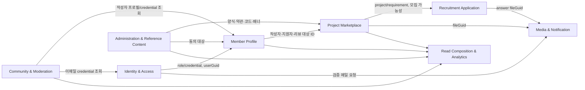
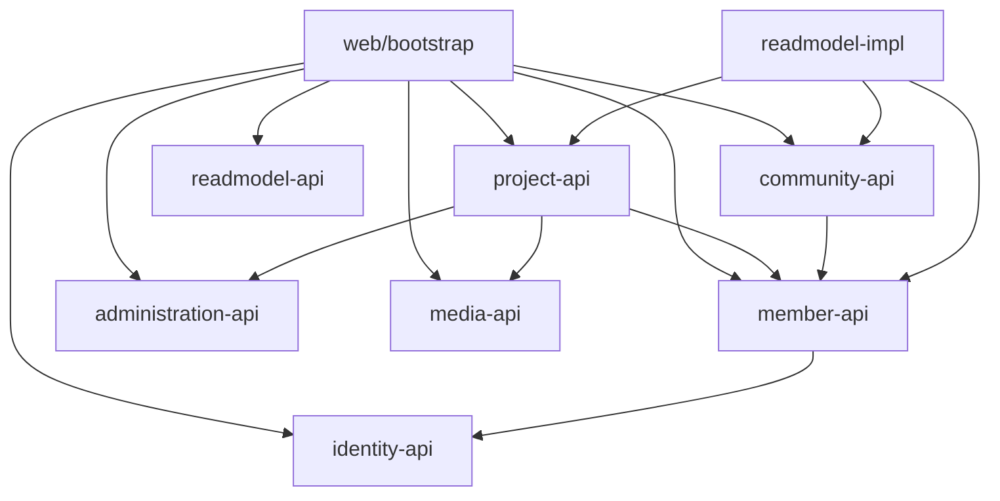

# 모놀리스에서 MSA로의 도메인·바운디드 컨텍스트 분석

> 분석 기준: 2026-09-15, `../src/main/java`, `src/test/java`, Gradle 설정, Spring 설정 및 `script/01.테이블생성/table-schema.sql`을 읽어 확인했다. 이 문서는 **현재 구현의 관찰 사실**과 그에 대한 **아키텍처 해석/향후 권고**를 구분한다. 프로덕션 코드는 변경하지 않았다. SQL 스크립트는 테이블 식별의 보조 근거이며, 개발 실행 설정은 `ddl-auto: update`이므로 실제 운영 스키마와 완전히 일치하는지는 이 저장소만으로 단정할 수 없다.

## 1. Executive Summary

### Current State

DevHub는 Java 17, Spring Boot 3.5.7의 **단일 Gradle 프로젝트/단일 배포 단위**다. `api`(REST), `core`(도메인·유스케이스·포트·facade), `outbound`(JPA·파일·보안·OAuth·메일)라는 헥사고날 의도의 패키지가 있으나, 컴파일 모듈 경계는 없다. 핵심 기능은 사용자/인증, 프로젝트 게시와 모집, 프로젝트 지원, 커뮤니티 게시판, 운영 관리, 파일, 약관, 알림, 홈 조합 조회, 기술 트렌드 조회다.

가장 중요한 결합은 `ProjectFacade`, `ProjectApplicationFacade`, `UserSignupFacade`, `UserReviewFacade`가 여러 도메인의 유스케이스·때로는 리포지터리를 하나의 로컬 트랜잭션으로 묶는 부분이다. 예를 들어 회원가입은 자격증명·사용자 프로필·약관 동의·인증 소비·토큰 발급·마지막 로그인 갱신을 한 트랜잭션에서 수행한다. 프로젝트는 지원서 양식과 연결되고, 지원 인원 수와 프로젝트 상세를 조합한다. 이는 현재 모놀리스에서는 일관성을 주지만, 그대로 원격 호출로 바꾸면 분산 트랜잭션 문제가 된다.

### Architectural Interpretation

의미 있는 최소 경계는 다음 여덟 개다.

1. **Identity & Access**: 로그인 자격증명, OAuth, 검증, JWT/refresh token.
2. **Member Profile**: 사용자 공개 프로필, 기술/포지션, 매너 점수와 리뷰.
3. **Project Marketplace**: 프로젝트 게시, 요구 포지션, 기술, 좋아요, 모집 상태.
4. **Recruitment Application**: 프로젝트 지원서·답변·승인/취소 및 프로젝트별 양식 연결.
5. **Community & Moderation**: 게시글·댓글·좋아요 및 신고 처리.
6. **Administration & Reference Content**: 공통 코드, 표준/사용자 정의 지원 양식, 배너, 약관.
7. **Media & Notification**: 첨부파일 메타데이터/로컬 저장소와 이메일 검증 발송·인앱 알림.
8. **Read Composition & Analytics**: 홈 화면 조합과 기술 수요/공급 통계. 이는 쓰기 도메인보다 읽기 모델에 가깝다.

### Recommendation

먼저 서비스 수를 늘리지 말고, 위 경계를 **모듈러 모놀리스**에서 컴파일 단위로 강제해야 한다. 초기 추출 후보는 현재 외부 SMTP 의존성이 있고 비교적 단순한 **Notification delivery**이지만, 인앱 `NOTIFICATION` CRUD까지 함께 분리할지는 사용량/전송 요구를 확인한 뒤 결정해야 한다. 핵심 거래 흐름인 Project Marketplace와 Recruitment Application은 현재 데이터와 트랜잭션이 밀접하므로 나중에 분리하거나 우선 한 모듈로 유지하는 편이 안전하다.

## 2. Current Architecture Overview

### Current State

* `../build.gradle`은 Spring MVC/WebFlux, JPA, QueryDSL, Security, Mail, Thymeleaf, Actuator, AOP, Micrometer tracing/Prometheus, OpenAPI를 한 애플리케이션에 넣는다. `settings.gradle`은 `rootProject.name = 'devhub-b'`만 선언하며 하위 모듈이 없다.
* `application.yml`의 기본 datasource는 H2, `application-prd.yml`은 MySQL 환경 변수를 사용한다. `/api` context path, `open-in-view: false`, Actuator 전체 노출, Prometheus registry가 설정되어 있다.
* `api.*.controller`가 HTTP를 받고, 다수는 `core.*.port.in.facade`를 호출한다. `core`는 `port.in/usecase`, `port.out`, `domain`, `application`을 포함하며, `outbound`가 JPA adapter/repository, OAuth HTTP, JWT, 파일, 메일을 구현한다.
* 인바운드 HTTP는 `/user`, `/auth`, `/projects`, `/boards`, `/reports`, `/notification`, `/terms`, `/files`, `/home`, `/skill-trends`, `/admin/**`에 있다. 대표 endpoint는 `ProjectController`, `ApplicationController`, `BoardController`, `AuthController`, `OAuthController`, `UserProfileController`에 실제로 선언되어 있다.
* 비동기/스케줄/도메인 이벤트는 `@Async`, `@Scheduled`, `ApplicationEvent`, `@EventListener`, `@TransactionalEventListener` 검색에서 확인되지 않았다. 메일은 요청 스레드에서 `EmailNotificationSendAdapter.sendVerification()`이 `JavaMailSender.send()`를 직접 실행한다.
* 테스트 Java 파일은 208개가 확인되며, domain/application/facade/outbound adapter와 보안/공통 설정에 fake adapter를 사용한 단위·중간 수준 테스트가 있다. 이 수치만으로 통합 E2E·계약·부하 테스트의 존재는 판단할 수 없다.

### 대표 요청 흐름(코드 근거)

| 흐름 | 실제 호출/저장 경로 | 해석 |
|---|---|---|
| 이메일 회원가입 | `UserSignupController` → `UserSignupFacade.signup()` → `VerificationUseCase.assertAllowed` → `UserCredentialUseCase.signupEmailUser` → `UserSignupUseCase.saveEmailUserInfo` → `TermsUseCase.saveTermsAgreement` → `AuthenticationUseCase.login` → `JwtTokenCodec`/`REFRESH_TOKEN` | Identity, Member, Terms가 하나의 트랜잭션에 결합한다. |
| 프로젝트 생성 | `ProjectController` → `ProjectFacade.createProject()` → `UserProfileUseCase.getUserInfo`, `ApplicationFormUseCase.saveApplicationForms`, `ProjectUseCase.createProject` → `ProjectService`가 `PROJECT`, `PROJECT_SKILL`, `PROJECT_REQUIREMENT`, `PROJECT_APPLICATION_FORM` 저장 | 프로젝트 작성이 양식 관리와 사용자 조회를 동기 호출한다. |
| 지원 | `ApplicationController` → `ProjectApplicationFacade.createApplication()` → `ProjectUseCase.getProjectDetail`/`Project.assertApplicable` → `ProjectApplicationUseCase.createApplication` → `PROJECT_APPLICATION`, `PROJECT_APPLICATION_ANSWER` | 지원 서비스가 프로젝트 도메인 규칙을 호출해 검사한다. |
| 게시글 상세 | `BoardController` → `BoardFacade.detailBoard` → `BoardService.detailBoard` → Board/Like/Comment repository + `UserRepository` + `EmailUserCredentialRepository` | Community가 Member와 Identity의 내부 저장 포트를 직접 읽는다. |
| 이메일 인증 발송 | `VerificationController` → `VerificationFacade` → `VerificationService.issueVerification` → `NotificationService.sendVerification` → `EmailNotificationSendAdapter` → SMTP | 검증 레코드 저장과 외부 메일 전송의 원자성 보장은 없다. |

## 3. Repository Structure

```text
src/main/java/teamdevhub/devhub
├── api/                 # Controller, HTTP request/response DTO, CookieFactory
├── core/
│   ├── auth, user, project, application, board, report, terms, file
│   ├── notification, home, skilltrend
│   ├── admin/{banner,code,form}
│   └── common, web       # port, facade, domain, application 혼재
├── outbound/             # JPA adapters/entities/repositories, QueryDSL/JPQL DAO,
│                          # JWT/Spring Security, OAuth clients, SMTP, local file storage
└── shared/               # config, exception, logging, enums, util
```

### Architectural Interpretation

`core`가 도메인 중심으로 나뉘어 있는 점과 `port.out`의 존재는 좋은 출발점이다. 다만 Facade가 `api.*` DTO를 반환하고, `ProjectService`가 `outbound.project.adapter.mapper.ProjectMapper`를 import하며, `TokenParseProvider`가 `outbound.auth.infrastructure.token.vo.AccessTokenInfo`를 반환한다. 따라서 현재의 패키지는 물리적 경계가 아니라 관례적 경계다.

## 4. Business Capability Map

| 분류 | 비즈니스 역량 및 책임 | 주요 구현 근거/외부 의존 |
|---|---|---|
| 핵심 | **프로젝트 마켓플레이스**: 프로젝트 공고 작성·수정·삭제, 모집 요구/기술, 좋아요, 모집 마감 | `ProjectService`, `ProjectLikeService`, `ProjectFacade`; `PROJECT*` 테이블 |
| 핵심 | **지원 및 선발**: 프로젝트별 지원 양식, 답변, 지원/취소, 승인/반려, 참여자/리뷰 가능 여부 | `ProjectApplicationService`, `AdminProjectApplicationService`, `ProjectApplicationFacade`, `ProjectMemberService`; `PROJECT_APPLICATION*` |
| 핵심 | **회원 프로필과 신뢰**: 공개 프로필, 기술·포지션, 차단/탈퇴, 프로젝트 동료 평가 및 매너 점수 | `UserProfileService`, `UserReviewService`, `UserReviewFacade`; `USERS`, `USER_SKILL`, `USER_POSITION`, `USER_REVIEW` |
| 지원 | **식별·접근**: 이메일/OAuth 가입, 인증 코드, 로그인, 토큰 재발급/폐기 | `AuthenticationService`, `UserCredentialService`, `VerificationService`, OAuth adapters, `JwtTokenCodec`; OAuth provider HTTP, SMTP |
| 지원 | **커뮤니티와 운영 신고**: 게시글·댓글·좋아요, 신고 생성/처리, 관리자 게시글 관리 | `BoardService`, `CommentService`, `BoardLikeService`, `ReportService`; `BOARD`, `COMMENT`, `BOARD_LIKE`, `REPORT` |
| 지원 | **운영 콘텐츠/정책**: 표준 및 맞춤 지원 양식, 약관, 배너, 공통 코드 | `ApplicationFormService`, `TermsService`, `BannerService`, `CommonCodeService`; `APPLICATION_FORM*`, `TERMS*`, `BANNER`, `COMMON_CODE` |
| 범용 | **미디어**: 업로드/다운로드/삭제와 메타데이터 | `FileService`, `LocalFileStorage`; filesystem 및 `ATTACHMENT_FILE` |
| 범용 | **알림 전달**: 이메일 검증 발송, 인앱 알림 체크/목록 | `NotificationService`, `EmailNotificationSendAdapter`; SMTP, `NOTIFICATION` |
| 읽기/분석 | **홈·분석**: 배너/최근 프로젝트/인기 게시글 조합, 기술 수요·공급 | `HomeQueryService`, `SkillTrend*Service`, `HomeBoardQueryDaoImpl`, `SkillTrendQueryDaoImpl` |

## 5. Candidate Bounded Contexts

### 5.1 Identity & Access — 높은 신뢰도

**책임/유스케이스.** 사람 또는 OAuth 주체의 인증, 이메일 검증, credential 등록, 로그인/로그아웃, JWT access/refresh/temp token 발급이다. `AuthController`, `OAuthController`, `VerificationController`; `AuthenticationService`, `UserCredentialService`, `OAuthAuthenticationService`, `OAuthResolveService`, `VerificationService`가 근거다.

**소유 개념/데이터.** `EmailUserCredential`, `OAuthUserCredential`, `Verification`, `RefreshToken`, `AuthenticatedUser`, `OAuthUser`; `REFRESH_TOKEN`, `VERIFICATIONS`와 credential entity가 논리적 소유다. `JwtTokenCodec`, OAuth Google/GitHub/Kakao/Naver adapter, password encoder가 outbound 의존이다.

**경계 문제.** `AuthenticationService.withCurrentRole()`가 `UserRepository.findByUserGuid()`로 Member의 `User`를 읽어 role을 재구성한다. `UserSignupFacade`는 Identity 생성 뒤 Member·Terms를 직접 수정한다. 신뢰도는 인증 언어와 저장물이 독립적이지만 사용자 lifecycle과 role이 얽혀 있어 완전한 데이터 독립성은 아직 없기 때문이다.

### 5.2 Member Profile & Reputation — 높은 신뢰도

**책임/유스케이스.** 프로필·소개·이미지·보유 기술/포지션, 사용자 상태, 탈퇴/차단, 동료 리뷰와 매너 점수다. `UserProfileController`, `AdminUserController`, `UserProfileService`, `UserReviewService`, `UserReviewFacade`가 구현 근거다.

**소유 개념/데이터.** `User`, `UserSkill`, `UserPosition`, `UserReview`, `UserRole`; `USERS`, `USER_SKILL`, `USER_POSITION`, `USER_REVIEW`. Project의 작성자/참여자 참조는 ID와 이름 스냅샷(`PROJECT.USER_GUID`, `PROJECT.USERNAME`)으로 소비되어야 한다.

**경계 문제.** `UserReviewFacade.reviewMember()`는 Project의 `ProjectMemberUseCase.validateReviewable()`와 Member 리뷰 저장·매너 갱신을 한 트랜잭션으로 수행한다. `USER_REVIEW.PROJECT_GUID` FK도 프로젝트 경계를 가로지른다.

### 5.3 Project Marketplace — 높은 신뢰도

**책임/유스케이스.** 공고의 작성·목록/상세·수정/삭제·마감, 요구 역할/레벨/정원, 기술, 좋아요다. `ProjectController`, `AdminProjectController`, `ProjectService`, `ProjectLikeService`가 근거다.

**소유 개념/데이터.** `Project` 애그리거트와 `ProjectRequirement`, `ProjectSkill`, `ProjectLike`; `PROJECT`, `PROJECT_REQUIREMENT`, `PROJECT_SKILL`, `PROJECT_LIKE`. `PROJECT_APPLICATION_FORM`은 지원 컨텍스트와 공동 사용되는 현재 결합 데이터다.

**경계 문제.** `ProjectService`가 `ProjectApplicationFormRepository`를 직접 주입하고 생성/수정/삭제한다. `ProjectFacade`는 Admin Form, User Profile, File, Application을 직접 호출한다. 즉 프로젝트의 게시 책임과 지원 양식 템플릿 관리/지원 현황 표시가 한 façade에 섞여 있다.

### 5.4 Recruitment Application — 중간 신뢰도

**책임/유스케이스.** 신청서 제출·답변 첨부·취소, 관리자/작성자의 승인·반려, 지원자 조회 및 모집 인원 계산이다. `ApplicationController`, `ProjectApplicationService`, `AdminProjectApplicationService`, `ProjectApplicationFacade`가 근거다.

**소유 개념/데이터.** `ProjectApplication`, `ProjectApplicationAnswer`, `ProjectApplicationForm`, `ProjectApplicationScore`; `PROJECT_APPLICATION`, `PROJECT_APPLICATION_ANSWER`, `PROJECT_APPLICATION_FORM`.

**경계 문제/신뢰도.** `ProjectApplicationFacade.createApplication()`이 `Project.assertApplicable()`를 호출하고, 목록/상세는 `ProjectRequirement`와 승인 수를 조합한다. `PROJECT_APPLICATION`이 `PROJECT`, `USERS`에 FK를 둔다. 책임은 명확하지만 모집 정원과 승인 규칙의 최종 소유자가 Project인지 Application인지 현 구현만으로 완전히 결정되지 않아 중간이다. 당분간 Project와 같은 배포 모듈에 둔다.

### 5.5 Community & Moderation — 높은 신뢰도

**책임/유스케이스.** 게시글·댓글·좋아요와 커뮤니티 대상 신고/처리다. `BoardController`, `CommentController`, `AdminBoardController`, `ReportController`, `BoardService`, `CommentService`, `ReportService`가 근거다.

**소유 개념/데이터.** `Board`(루트), `Comment`, `BoardLike`, `Report`; `BOARD`, `COMMENT`, `BOARD_LIKE`, `REPORT`.

**경계 문제.** `BoardService.detailBoard()`가 `UserRepository`와 `EmailUserCredentialRepository`를 직접 읽어 작성자 이름/파일/email을 채우고, `CommentService.commentList()`가 `UserRepository.findNamesByUserGuid()`를 호출한다. `ReportService.createReport()`는 Board/Comment repository에 직접 접근한다. 신고는 moderation 하위 모듈로 시작하되 Community와 같은 모듈이 적절하다.

### 5.6 Administration & Reference Content — 중간 신뢰도

**책임/유스케이스.** 공통 코드, 배너, 표준/맞춤 지원양식, 약관의 운영·조회다. `CommonCodeService`, `BannerService`, `ApplicationFormService`, `TermsService`가 근거다.

**소유 데이터.** `COMMON_CODE`, `BANNER`, `APPLICATION_FORM`, `APPLICATION_FORM_ITEM`, `TERMS`, `TERMS_AGREEMENT`.

**경계 문제.** 프로젝트가 `ApplicationFormUseCase.saveApplicationForms/deleteApplicationForms`를 호출해 양식 lifecycle을 소유한다. 회원가입은 `TermsUseCase.saveTermsAgreement`를 호출한다. 이들은 운영 데이터와 각 업무의 스냅샷/동의 기록을 섞는다. `TERMS_AGREEMENT`는 Member 참조이지만 약관 컨텍스트가 기록의 규칙을 소유하는 것이 자연스럽다. 독립 서비스 후보로는 너무 작고 참조가 많아 중간 신뢰도다.

### 5.7 Media & Notification — 중간 신뢰도

**책임/유스케이스.** 파일 저장/메타데이터/다운로드, 검증 이메일 전송, 인앱 알림 생성/읽음 처리다. `FileService`, `NotificationService`, `EmailNotificationSendAdapter`가 근거다.

**소유 데이터/의존.** `ATTACHMENT_FILE`, `NOTIFICATION`; local filesystem, SMTP, Thymeleaf template. 파일 GUID는 Project/User/지원 답변/Banner에서 참조한다.

**경계 문제.** `FileService.upload()`는 파일 저장 후 DB를 저장하고 `delete()`는 DB 삭제 후 파일 삭제하므로 저장소와 DB의 원자적 트랜잭션은 없다. `NotificationService.sendVerification(IssuedVerification)`는 Auth의 application DTO에 의존한다. 인앱 알림이 실제 어느 업무 이벤트에서 생성되는지는 검색된 구현으로 특정할 수 없다.

### 5.8 Read Composition & Analytics — 높은 신뢰도(읽기 경계)

**책임/유스케이스.** 홈의 배너/최근 프로젝트/인기 게시글 조합, 프로젝트와 사용자 기술 데이터를 집계한 트렌드다. `HomeQueryService`, `SkillTrendStatisticsService`, `SkillTrendAnalyticsService`가 근거다.

**경계 문제.** `HomeBoardQueryDaoImpl`은 QueryDSL로 `BOARD`·`USERS`·`BOARD_LIKE`를 join한다. `SkillTrendQueryDaoImpl`은 JPQL로 `ProjectEntity`/`ProjectSkillEntity`/`ProjectRequirementEntity` 및 `UserEntity`/`UserSkillEntity`/`UserPositionEntity`를 join한다. 쓰기 모델의 cross-context DB를 직접 조회하므로 독립 서비스가 아니라 현재는 read-composition 모듈로 둔다.

## 6. Context Map



### 관계별 실제 메커니즘

| 방향 | 이유/교환 데이터 | 현재 메커니즘 | 판정 |
|---|---|---|---|
| Identity → Member | 가입 시 `userGuid`, role/credential; 로그인 시 최신 role | `UserSignupFacade`의 로컬 호출, `AuthenticationService`의 `UserRepository` 접근 | 상호 lifecycle 결합 |
| Member ↔ Project | 작성자/좋아요/지원자/리뷰 대상 ID, 작성자 이름·프로필 | FK, facade/use case, repository 조회 | Project→Member와 Member→Project 양방향 의존 |
| Project ↔ Recruitment | requirement, 모집 가능 여부, 승인 인원/신청서 | use case 직접 호출, shared `PROJECT_APPLICATION_FORM`, FK | 가장 강한 업무 결합 |
| Project → Admin Form | 프로젝트용 맞춤 양식 생성/삭제 | `ProjectFacade`가 `ApplicationFormUseCase` 직접 호출 | lifecycle 소유권 불명확 |
| Community → Member/Identity | 작성자명·프로필 파일·email | `BoardService`/`CommentService`의 repository 직접 접근 | 내부 모델 노출 |
| Home/Analytics → 여러 쓰기 컨텍스트 | 화면 DTO·집계 | QueryDSL/JPQL cross-table join | 읽기 전용이지만 DB 결합 높음 |
| Auth → Notification | verification target/message | 직접 Java method call 후 SMTP | 이벤트/재시도 없음 |

명시적 Java 순환 import는 이 분석에서 기계적으로 전수 그래프화하지 않았으나, **논리적 순환**은 확인된다: Member가 `ProjectMemberUseCase`로 리뷰 자격을 확인하는 동시에 Project/Board가 Member repository를 읽고, Identity가 Member role을 읽으며 가입은 Identity→Member로 진행한다. 이는 공개 API와 읽기 모델로 끊어야 한다.

## 7. Domain / Aggregate Analysis

| 후보 애그리거트 루트 | 내부 개념 | 확인 가능한 불변식/트랜잭션 | 타 애그리거트 참조·분리 시 주의 |
|---|---|---|---|
| `User` | `UserSkill`, `UserPosition`, 프로필/상태 | `UserSignupService`가 사용자·기술·포지션을 저장; `UserWithdrawService.withdraw()` 후 삭제 | credential은 `User` 내부 엔티티가 아니라 Identity 소유으로, ID 참조가 적절 |
| `Project` | `ProjectRequirement`, `ProjectSkill`, `ProjectLike` | 생성/수정/삭제에서 여러 repository를 `@Transactional`로 변경; `assertApplicable`, `isProgressCompleted` | User, File, Application Form, Application은 객체 연관 대신 GUID로 유지해야 함 |
| `ProjectApplication` | `ProjectApplicationAnswer`, `ProjectApplicationScore`(조회 표현) | 생성 시 application+answers 저장, 취소 시 `assertCancelable`, 승인 상태 변경 | project/requirement/applicant/approver/file GUID를 외부 ID로 유지 |
| `Board` | `Comment`, `BoardLike` | 본인 검증 후 수정/삭제, 삭제 시 댓글·좋아요 삭제 | User GUID만 참조. `Report`는 별도 moderation aggregate가 적절 |
| `Terms` | `TermsAgreement`(기록 aggregate로도 가능) | 존재하는 모든 약관 GUID 검증 후 동의 기록 일괄 저장 | user GUID 외부 참조; 과거 약관 내용/버전 보존 정책은 코드에서 확정 불가 |
| `ApplicationForm` | `ApplicationFormItem` | `ApplicationFormService`가 생성/저장/삭제 | 프로젝트별 form link는 Recruitment 소유 link로 옮기는 방향 검토 |
| `FileMetadata` | 저장소의 bytes | `FileService`의 metadata+storage 순서 작업 | 다른 컨텍스트는 `fileGuid`만 저장, 소유권은 Media |

JPA entity들은 대부분 `@ManyToOne` 등의 객체 관계 대신 GUID 문자열 컬럼을 사용한다. 이는 현재 QueryDSL/수동 mapper 비용은 있지만, 서비스 분리 시 객체 그래프가 경계를 넘지 않는 장점이다. 반면 DB FK(`PROJECT`→`USERS`, `PROJECT_APPLICATION`→`PROJECT`/`USERS`, `BOARD`/`COMMENT`→`USERS` 등)는 논리 소유권을 물리적으로 강결합한다.

## 8. Data Ownership Analysis

| 도메인 데이터 | 현재 사용 | 제안 논리 소유자 | 다른 소비자/문제 |
|---|---|---|---|
| `USERS`, `USER_SKILL`, `USER_POSITION`, `USER_REVIEW` | 프로필, 프로젝트 작성/상세, 게시글/댓글, 분석 | Member Profile | Identity가 role을 읽고, Analytics가 user skill/position을 join |
| credential entities, `REFRESH_TOKEN`, `VERIFICATIONS` | 로그인/OAuth/인증, Board/Project 상세 email | Identity & Access | Community/Project가 `EmailUserCredentialRepository` 직접 조회; 공개 profile API로 전환 필요 |
| `PROJECT`, `PROJECT_REQUIREMENT`, `PROJECT_SKILL`, `PROJECT_LIKE` | 공고, 지원 가능 여부, 홈/분석 | Project Marketplace | Recruitment가 requirement/프로젝트에 의존, Analytics 직접 읽음 |
| `PROJECT_APPLICATION*` | 지원·답변·승인·참여자 판단 | Recruitment Application | ProjectService가 form-link를 저장/삭제, Project 화면이 승인 수를 직접 요청 |
| `BOARD`, `COMMENT`, `BOARD_LIKE`, `REPORT` | 커뮤니티/신고/홈 인기글 | Community & Moderation | Home의 DB join; report가 board/comment repository를 직접 읽음 |
| `APPLICATION_FORM*`, `COMMON_CODE`, `TERMS*`, `BANNER` | 운영 설정, 프로젝트 양식, 가입 동의, 홈 | Administration & Reference Content | 맞춤 form lifecycle을 Project가 개입; `TERMS_AGREEMENT.USER_GUID` 교차 FK |
| `ATTACHMENT_FILE`, 로컬 bytes | 프로젝트/사용자/지원답변/배너 | Media | 다수 table의 file GUID, 고아 파일/삭제 정책 필요 |
| `NOTIFICATION` | 읽음 처리/목록 | Notification | 생성 트리거가 제한적으로만 확인됨; 이메일 발송은 별도 delivery concern |

**공동 쓰기 문제.** `ProjectFacade.createProject/updateProject/deleteProject`와 `ProjectService`가 모두 Application Form 관련 lifecycle을 조정한다. `UserReviewFacade`는 프로젝트 검증과 사용자 점수 갱신을 한 로컬 트랜잭션에 묶는다. `UserSignupFacade`는 최소 다섯 컨텍스트의 쓰기를 한 트랜잭션에 묶는다. 이것이 향후 database-per-service 이전 전에 제거해야 할 우선순위 높은 결합이다.

## 9. Dependency & Coupling Analysis

| 유형·심각도 | 구체적 근거 | 왜 어려운가 | 향후 방향 |
|---|---|---|---|
| 도메인/트랜잭션 — 높음 | `UserSignupFacade.signup()`/`signupWithOAuth()` | credential, profile, terms, verification, session state가 atomic local transaction | 가입 orchestration을 application workflow로 명시하고 보상/상태 모델을 먼저 설계. 초기에는 같은 모듈러 모놀리스 transaction 유지 |
| 도메인/영속 — 높음 | `BoardService.detailBoard()` → `UserRepository`, `EmailUserCredentialRepository`; `CommentService` → `UserRepository` | Community가 Member/Identity의 repository와 도메인 객체에 직접 의존 | `MemberPublicProfileQuery` 같은 공개 읽기 포트 또는 projection 계약으로 대체 |
| 도메인/트랜잭션 — 높음 | `UserReviewFacade` → `ProjectMemberUseCase` + `UserReviewUseCase` + `UserProfileUseCase` | 프로젝트 완료/멤버십과 매너 점수 갱신이 한 트랜잭션 | Project가 review-eligible 사실을 발행하거나 동기 public API를 제공; 점수는 idempotent event consumer로 고려 |
| 영속/공유 모델 — 높음 | `ProjectService`가 `core.application.port.out.ProjectApplicationFormRepository`를 사용 | Project가 Recruitment link table을 직접 생성/삭제 | link의 owner를 Recruitment로 정하고 Project public command로 요청 |
| 도메인/조회 — 높음 | `ProjectFacade`가 Form/User/File/Application use case 및 credential repository를 주입 | 한 façade가 화면 조합과 업무 쓰기를 겸함; N+1 가능성(`getUserProjects`) | command workflow와 read composition을 분리, context API 반환은 ID/전용 DTO만 |
| 영속 — 높음 | `HomeBoardQueryDaoImpl`의 board-user-like join, `SkillTrendQueryDaoImpl`의 project/user cross JPQL | database 분리 시 조인이 불가능 | outbox/event 기반 분석 projection 또는 각 서비스 API aggregation; 먼저 읽기 모델 정의 |
| 공유 모델 — 중간 | `shared.enums`의 `ProjectApprovalStatus`, `UserStatus`, `NotificationType`, `ErrorCode` | 독립 서비스가 한 enum 배포에 묶임 | wire contract는 versioned 문자열/코드; shared는 기술 유틸과 안정 계약만 |
| 인프라/레이어 — 중간 | `core.project.application.ProjectService` → `outbound...ProjectMapper`; `core.*.facade` 다수가 `api.*Dto` 반환 | core가 adapter DTO/mapper에 의존 | mapper/HTTP response 조립을 inbound adapter로 이동; core는 command/result만 노출 |
| 인프라/레이어 — 중간 | `TokenParseProvider`가 outbound VO를 return; `CompositeMessageSenderSelector`가 outbound exception import | port가 adapter 타입에 역의존 | port 타입을 core로 이동하고 adapter가 구현 |
| 인증 — 중간 | `JwtAuthorizationFilter`가 `AuthenticatedUser`를 Spring `SecurityContext`에 직접 설정 | 각 추출 서비스가 동일 JWT secret/claim 모델에 묶일 위험 | Identity issuer/JWKS 또는 중앙 검증 전략을 추출 시점에 결정; 현재는 단일 token contract 유지 |
| 외부 I/O — 중간 | `FileService` DB↔filesystem, `EmailNotificationSendAdapter` SMTP | 실패 시 metadata/bytes 또는 verification/전송 결과 불일치 | durable job/outbox, 재시도·idempotency·보상 정책을 도입할 준비 |

## 10. Hexagonal Architecture Assessment

### 잘 구현된 점

* `UserRepository`, `ProjectRepository`, `ApplicationRepository`, `FileStorage`, `NotificationSender`처럼 outbound port가 있고 `Jpa*Repository`/adapter 또는 `LocalFileStorage`가 구현한다.
* `JwtTokenCodec`은 `TokenIssueProvider`와 `TokenParseProvider`를 구현하고, OAuth provider도 `OAuthClient` port 구현체로 선택된다.
* 많은 service가 use case를 구현하고 `@Transactional`을 application service에 둔다. `open-in-view: false`도 웹 계층의 lazy persistence 누수를 줄이는 설정이다.

### 위반과 해석

| 관찰 사실 | 평가 |
|---|---|
| `ProjectService`가 `outbound.project.adapter.mapper.ProjectMapper`를 import | application이 outbound adapter에 의존하는 명백한 역방향 의존 |
| `ProjectApplicationFacade`, `BoardFacade`, `HomeFacade` 등 core facade가 `api.*` request/response DTO와 `DataApiResponseDto`를 import | inbound HTTP 표현이 core에 누출됨 |
| `TokenParseProvider`가 `outbound.auth.infrastructure.token.vo.AccessTokenInfo`/`TempTokenInfo`를 반환 | port contract가 infrastructure VO에 의존 |
| `BoardService`/`ReportService`가 타 컨텍스트 repository를 직접 주입 | port는 있으나 컨텍스트 API가 아니라 persistence API를 공유 |
| `@Service`, `@Transactional`, Lombok은 core domain/application에 존재 | Spring annotation 자체는 domain object보다 service에 집중되어 있어 심각도는 낮지만, pure domain 테스트 가능성은 annotation-free domain으로 더 높일 수 있음 |
| controllers가 대체로 facade/use case를 호출하고 repository를 직접 주입하지 않음 | inbound adapter 원칙은 상당 부분 준수 |

## 11. Proposed Modular Monolith Architecture

다음은 현재 패키지를 즉시 옮기라는 지시가 아니라, 향후 Gradle 다중 모듈화 때의 목표 구조다. `*-api`는 다른 모듈이 호출할 command/query/result와 use case만 둔다. JPA entity/repository/adapter와 HTTP DTO는 노출하지 않는다.

```text
devhub
├── bootstrap                 # Spring Boot 조립, configuration
├── platform                  # exception, tracing, ID/time 등 비즈니스 비종속 기술
├── identity/{api,impl}
├── member/{api,impl}
├── project/{api,impl}        # marketplace + recruitment를 초기에는 함께
├── community/{api,impl}      # moderation 포함
├── administration/{api,impl} # forms, terms, banner, common code
├── media/{api,impl}
├── notification/{api,impl}
├── readmodel/{api,impl}      # home/analytics query composition
└── web                       # REST controller/request-response mapping
```

| 모듈 | 포함 후보 | 허용 의존 | 금지 의존/공개 인터페이스 |
|---|---|---|---|
| `identity` | `core.auth`, `outbound.auth`, security 일부 | `platform`, SMTP notification API | Member JPA repository. 공개: authentication/credential/verification query-command |
| `member` | `core.user`, `outbound.user` | `identity-api`, `project-api`(review eligibility) | Project entity/repository. 공개: public profile, member status, reputation command |
| `project` | `core.project`, `core.application`, 해당 outbound | `member-api`, `administration-api`, `media-api` | User/Form/File JPA repository. 공개: project lifecycle, application lifecycle, read DTO |
| `community` | `core.board`, `core.report`, outbound board/report | `member-api` 및 제한된 identity public query | User/credential repository. 공개: community profile projection 요청/게시 API |
| `administration` | `core.admin.*`, `core.terms`, outbound counterparts | `member-api`(동의 기록) | Project repository. 공개: form template/terms/banner/code API |
| `media` | `core.file`, `outbound.file` | `platform` | 소비자 domain entity. 공개: upload/read/delete metadata by `fileGuid` |
| `notification` | `core.notification`, mail adapter/template | `platform`; Identity의 중립 `DeliveryRequest` | Auth application VO. 공개: delivery command, notification inbox query |
| `readmodel` | `core.home`, `core.skilltrend`, outbound home/skilltrend | 각 `*-api`의 read contract | 타 모듈 JPA entity/repository; 직접 DB join은 과도기만 허용 |
| `web`/`bootstrap` | `api`, security wiring/config | 모든 public `*-api` | `*-impl`의 entity/repository/mapper 직접 import |

### 모듈 의존성 그래프



구현체는 자신의 `impl`만 참조한다. 모든 화살표는 **상대 모듈의 public application interface**까지만 허용한다. 공통 모듈에는 `BaseEntity`, enum, HTTP DTO를 무차별적으로 넣지 않는다. 특히 도메인 상태 enum은 소유 모듈에 남기고, 모듈 간에는 안정된 문자열 code/전용 result를 전달한다.

## 12. Module Dependency Rules

`web`은 각 `*-api`만 컴파일 의존하며, `*-impl`의 entity/repository/mapper를 직접 import하지 않는다. 구현체는 자신의 `impl`만 참조한다. 모든 화살표는 **상대 모듈의 public application interface**까지만 허용한다. 공통 모듈에는 `BaseEntity`, enum, HTTP DTO를 무차별적으로 넣지 않는다. 특히 도메인 상태 enum은 소유 모듈에 남기고, 모듈 간에는 안정된 문자열 code/전용 result를 전달한다.

## 13. Microservice Candidate Evaluation

| 후보 | 독립성/이점 | 현재 결합·분리 비용 | 판정 |
|---|---|---|---|
| Notification delivery | SMTP라는 외부 실패 격리, 재시도/관측/확장 가치가 명확 | Auth의 `IssuedVerification` 타입 의존, 동기 발송, 인앱 알림과의 관계 정리 필요 | **좋은 초기 추출 후보**. 먼저 중립 delivery command와 outbox를 만들 것 |
| Media | 파일 I/O/용량 스케일링과 보안 경계가 다름 | 모든 도메인이 `fileGuid` 참조, 현재 local filesystem; authorization·고아 파일 정책 필요 | **추출 후반**. 객체 저장소 전환·권한 계약 후 |
| Readmodel/Analytics | 읽기 부하 격리, projection에 잘 맞음 | 현재 cross DB join가 핵심이고 이벤트가 없음 | **추출 후반**. 먼저 read model/event pipeline 필요 |
| Community & Moderation | Project 거래와 업무 변경 주기가 비교적 다름 | 작성자 profile/credential lookup 및 home 인기글 join | **추출 후반**. public profile projection 후 가능 |
| Identity & Access | 보안 경계/배포 독립성의 이점 | Member role·가입 workflow·JWT secret/refresh token/콜백이 결합 | **추출 후반**. 가장 민감한 보안 migration 중 하나 |
| Project Marketplace + Recruitment | 핵심 업무이며 성장 시 스케일 가능 | FK, shared form link, 승인·정원·참여자·리뷰 트랜잭션이 강결합 | **함께 유지**. 먼저 단일 `project` 모듈 내부 submodule로 경계화 |
| Member Profile | 개념은 독립적 | Identity·Project·Community 모두 사용자 데이터를 즉시 읽음 | **함께 유지**. public profile 계약/복제 전략 확립 후 |
| Administration | 운영 기능은 응집 | 작고 참조가 많아 서비스 운영 비용 대비 이득 작음 | **당분간 함께 유지** |

## 14. Recommended Extraction Order

1. **기준선 고정**: 현재 208개 테스트와 API 동작을 CI 기준선으로 삼고, SQL/JPA mapping 및 실제 production schema 차이를 검증한다. 기존 `application.yml`의 개발용 민감 설정은 별도 보안 작업으로 회수/rotation한다.
2. **모듈러 모놀리스화**: 위 모듈을 Gradle compile boundary로 만들고 `web → *-api → *-impl`만 허용한다. 기능 변경 없이 `core → api/outbound` 역의존을 제거할 설계를 먼저 합의한다.
3. **논리 데이터 소유권 선언**: 표 8의 owner를 ADR/코드 소유 규칙으로 고정한다. 타 컨텍스트 repository/entity import를 금지하고 public use case 또는 read projection으로 바꾼다.
4. **핵심 workflow를 명시적으로 분리**: 회원가입, 프로젝트/양식 변경, 지원 승인/정원, 리뷰는 orchestration과 각 context command로 모델링한다. 아직 같은 DB/트랜잭션을 유지해도 된다.
5. **읽기 조합 분리**: `ProjectFacade`의 화면 조합과 `HomeBoardQueryDaoImpl`/`SkillTrendQueryDaoImpl`의 cross join을 전용 readmodel로 격리한다. 처음에는 같은 DB read-only projection으로 시작한다.
6. **이벤트의 신뢰성 확보**: 실제로 비동기화 가치가 있는 사실(예: verification requested, profile changed, project published)에 outbox, consumer idempotency, 재시도를 갖춘 application/domain event를 도입한다. 단순히 Kafka를 먼저 도입하지 않는다.
7. **첫 추출: Notification delivery**: SMTP delivery를 outbox consumer 또는 별도 worker/service로 추출한다. 실패가 가입/검증 DB 상태를 망가뜨리지 않도록 delivery 상태와 재시도 정책을 둔다. 이 단계에서 네트워크 timeout·trace propagation·운영 대시보드를 학습한다.
8. **그 다음 후보 재평가**: 실제 트래픽·팀 소유권·변경 빈도를 기준으로 Media 또는 Readmodel을 선택한다. Project/Recruitment/Member/Identity는 상호 계약과 데이터 복제가 성숙할 때까지 모듈러 모놀리스로 둔다.
9. **Gateway/메시징/오케스트레이션은 필요 시**: 두 개 이상의 외부 API가 인증/라우팅을 공통으로 요구할 때 API Gateway, 다수 독립 서비스의 비동기 통합이 검증된 뒤 messaging, 운영 복잡도가 정당화될 때 container orchestration/service mesh를 검토한다.

가장 안전하면서 교육적인 첫 후보는 **SMTP 이메일 전달 부분**이다. 핵심 거래 데이터를 소유하지 않고, 외부 I/O 실패·재시도·관측이라는 분산 시스템의 핵심을 작은 blast radius에서 학습할 수 있기 때문이다. 다만 `NOTIFICATION` inbox까지 무조건 함께 떼어내지는 말고, 실제 인앱 알림 생성 유스케이스가 확장될 때 ownership을 재평가한다.

## 15. MSA Migration Risks

| 구분/심각도 | 현재 상태 | MSA에서의 문제 | 미래 완화책 |
|---|---|---|---|
| 현재 존재 — 높음 | `UserSignupFacade`, `UserReviewFacade`, `ProjectFacade`가 multi-context local transaction | 원격 호출로 바꾸면 atomic commit 상실, 부분 성공 발생 | saga/보상보다 먼저 workflow 상태와 단일 owner를 정의; 필요한 경우 outbox |
| 현재 존재 — 높음 | DB FK와 cross-table QueryDSL/JPQL join | DB per service에서 join/FK 불가 | foreign ID + local projection/복제, query API. 물리 DB 분리는 마지막 |
| 현재 존재 — 높음 | 파일은 local filesystem, metadata와 bytes가 별도 작업 | 서비스 인스턴스 간 파일 접근 불가, 고아/누락 발생 | object storage, checksum, deletion lifecycle, 권한 있는 download URL |
| 현재 존재 — 중간 | SMTP 발송은 동기, `ExternalServiceException` | timeout이 API 실패로 번지고 재시도/중복 발송 불가 | persistent delivery job/outbox, idempotency key, DLQ/운영 알림 |
| 현재 존재 — 중간 | JWT HS256 단일 secret, access 30분/refresh 7일, refresh DB 저장 | 여러 서비스가 secret·claim·폐기 규칙을 공유 | issuer ownership, key rotation/JWKS 또는 gateway 검증, audience/issuer 설계 |
| 현재 존재 — 중간 | OAuth callback은 Auth controller와 provider adapter에 집중 | redirect, state, cookie, CSRF/세션 경계 migration이 민감 | Identity가 callback을 단독 소유, state persistence/검증과 redirect contract 테스트 |
| 현재 존재 — 중간 | TraceId MDC, AOP logging, Actuator/Prometheus가 있음 | HTTP/message 경계를 넘는 correlation·metrics가 없음 | W3C trace context, structured log, service/event metrics와 alert SLO |
| MSA 도입 시 — 높음 | 현재는 단일 DB ACID | 최종적 일관성, 이벤트 순서 역전, 중복 전달 | outbox, sequence/version, consumer dedupe, retry/backoff, reconciliation job |
| MSA 도입 시 — 중간 | 단일 deployment/security chain | API versioning, timeout/circuit breaker, 장애 전파 | 계약 테스트, timeout budget, fallback을 업무별로 설계 |
| MSA 도입 시 — 중간 | 운영 배포 단위 하나 | 서비스 수가 작은 팀의 배포/비용/관측 부담을 넘길 수 있음 | 독립 배포·스케일·소유권이라는 실제 근거가 생길 때만 추출 |

## 16. Recommended Next Steps

1. 이 문서의 data owner와 `Project Marketplace + Recruitment`를 한 모듈로 유지한다는 결정을 팀 ADR로 확정한다.
2. 모듈 경계 테스트(예: ArchUnit)를 추가할 계획을 세운다. 목표는 `web`이 entity/repository를, 다른 업무 모듈이 타 모듈 `impl`을 import하지 못하게 하는 것이다.
3. `ProjectFacade`, `UserSignupFacade`, `UserReviewFacade`의 호출 시퀀스를 계약으로 문서화하고, 실패 시 기대 상태를 테스트로 고정한다. 리팩터링은 그 다음 작업이다.
4. Community 작성자 정보, Project 작성자 정보, Analytics 입력을 위해 필요한 **최소 공개 읽기 계약**(예: `MemberPublicProfile`, `ProjectSummary`)을 정의한다. Entity/Repository를 계약으로 노출하지 않는다.
5. 파일 삭제·사용 권한·고아 정리와 이메일 전달 재시도/중복 발송 정책을 먼저 제품 정책으로 결정한다.
6. 첫 추출 전, Notification delivery를 모듈러 모놀리스 내 outbox consumer로 검증하고 운영 지표(성공률, 재시도, 대기 시간)를 확보한다.

## 부록: 관찰 한계와 보안 메모

* `table-schema.sql`에 식별된 FK를 사용했지만, JPA가 `ddl-auto: update`이고 schema script 자체의 credential table 대응 여부까지는 이 저장소만으로 확정할 수 없다. 운영 DB의 migration history와 실제 DDL을 별도 대조해야 한다.
* 스케줄러, 비동기 처리, 도메인 이벤트는 소스 검색에서 발견되지 않았다. 외부 플랫폼이 수행하는 작업은 저장소 밖이므로 판단하지 않았다.
* `application.yml`에는 개발용 mail/OAuth/JWT 민감 값이 평문으로 존재한다. 값은 이 문서에 재기록하지 않는다. MSA 전환과 별개로 즉시 secret rotation 및 secret manager/환경 주입으로의 이전을 우선 검토해야 한다.
