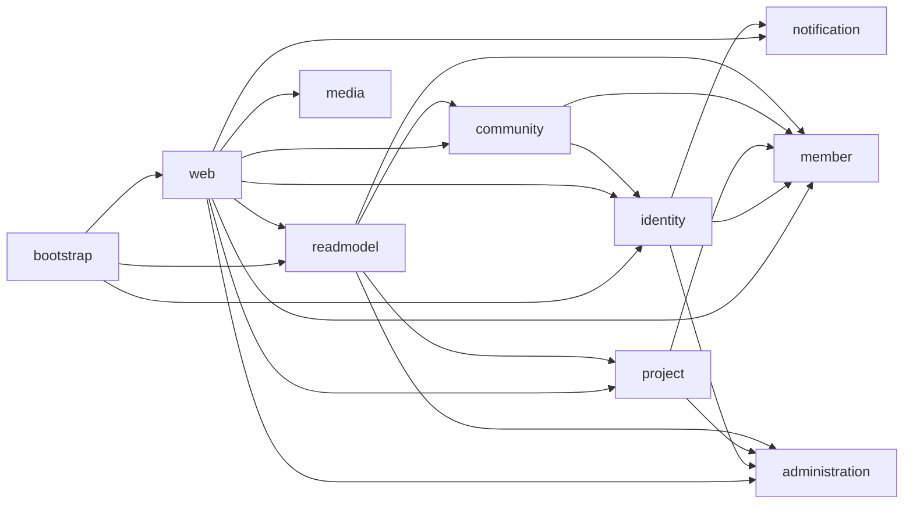

# DevHub 물리적 모듈화 완료 보고서

## 최종 구조와 책임

단일 Spring Boot 프로세스인 `bootstrap`이 `web`, `platform`, 여덟 개 비즈니스 컨텍스트를 조립한다. Root Gradle 프로젝트에는 비즈니스 production/test Java 소스가 없다. 컨텍스트당 하나의 Gradle 프로젝트를 사용하며 공개 계약은 각 프로젝트의 `.api` 패키지에 둔다.

| 모듈 | 책임 | Production `.java` | `*Test.java` |
|---|---|---:|---:|
| `platform` | 식별자·시간·감사·공통 기술 기반 | 22 | 6 |
| `identity` | 인증, 자격 증명, OAuth, 가입 흐름 | 115 | 34 |
| `member` | 회원 프로필·상태·역할 | 68 | 19 |
| `project` | 프로젝트와 모집 지원 | 86 | 3 |
| `community` | 게시판·댓글·신고 | 51 | 5 |
| `administration` | 약관·배너·공통 코드·지원 양식 | 76 | 4 |
| `media` | 파일 메타데이터·저장 | 20 | 4 |
| `notification` | 알림·이메일 발송 | 24 | 3 |
| `readmodel` | 홈·기술 동향 읽기 모델 | 39 | 2 |
| `web` | HTTP DTO·컨트롤러·필터·응답 조립 | 151 | 41 |
| `bootstrap` | 단일 실행 진입점·설정·통합/아키텍처 테스트 | 7 | 19 |

위 파일 수는 마지막 소스 이동 시점의 파일 기준이며 생성된 QueryDSL 소스는 제외한다. Root의 production/test Java 파일 수는 모두 0이다.

## Gradle 의존성과 공개 계약

`bootstrap`은 모든 실행 모듈을 조립한다. `web`은 HTTP 요청에 필요한 각 컨텍스트에 의존한다. 컨텍스트 의존성은 다음과 같이 단방향이다.

모든 컨텍스트와 `web`은 필요한 경우 `platform`에 의존한다. 그래프에 순환 의존은 없다. 각 모듈의 `build.gradle`이 JPA, QueryDSL, Security, JWT, Web, Mail, Thymeleaf 등 사용 라이브러리를 소유한다. Root에는 기능별 의존성을 전역 전파하지 않는다. `platform`의 QueryDSL annotation processor는 `BaseEntity`의 `QBaseEntity`를 생성하므로 유지한다.

대표적인 공개 계약은 `MemberPublicProfileQuery`, `CurrentMemberRoleQuery`, `AdminMemberProjectQuery`, `Report` 조회 계약, `PasswordLoginAvailabilityQuery`, `ApplicationForm` 조회·변경 계약, `AgreeTermsCommand`, `AuthenticatedUserCarrier`이다. `SearchApplicationFormCommand`는 실제 소유자인 `administration.api.form`으로 옮겼다. 가입 약관 입력은 `administration.api.terms`에 놓아 Identity가 Administration 내부 모델을 가져오지 않는다. `UserStatus`, `ProjectRecruitStatus`는 실제 외부 읽기 소비자를 위해 소유 컨텍스트의 `.api` 값으로 명시했다.

## 제거된 구조와 테스트 소유권

`*-api`/`*-impl` Gradle 임시 프로젝트는 `settings.gradle`에 없다. `teamdevhub.devhub.core.*`, `.outbound.*`, `.api.*`, `.shared.*` 형태의 production package 선언은 0건이다. 실제 경로와 package 선언의 불일치도 정리했다. 도메인 단위 테스트와 HTTP 단위 테스트는 소유 모듈로 이동했으며, `bootstrap`의 19개 테스트 클래스는 전체 Spring/JPA/Security 조립, 설정, 통합, 아키텍처 검증에 한정된다.

## 아키텍처 규칙

`ModularArchitectureTest`는 실제 source set을 읽어 비즈니스 컨텍스트의 타 컨텍스트 `.core`/`.outbound` 접근, 비즈니스 core의 HTTP 의존, `web`의 outbound 접근, `platform`의 비즈니스 의존을 검사한다. `readmodel.outbound`의 외부 `Q*Entity` 읽기 참조만 명시적으로 허용한다. 이는 단일 H2 데이터베이스 단계의 임시 읽기 전용 예외이며 서비스 분리 시 제거해야 한다. Java import 검사만으로 간접·동적 접근이나 SQL의 쓰기 여부까지 증명하지는 못한다.

## 검증 결과

| 항목 | 결과 |
|---|---|
| 전체 `testClasses` | PASS |
| 전체 `build` 및 테스트 | PASS, 537개 테스트·실패 0·skip 0 |
| `bootstrap:bootJar` | PASS (`bootstrap.jar`) |
| 강화된 `ModularArchitectureTest` | PASS |
| QueryDSL 생성 | PASS (`QBaseEntity` 및 소유 모듈 Q 타입) |
| Local 프로필 실행 | PASS; Spring Boot 시작, 28개 JPA repository 검색, H2 `jdbc:h2:mem:devhub`, JPA EntityManagerFactory, Security provider, Tomcat `/api` 확인 |

런타임 검증은 임의 포트와 메일 호스트 override로 수행했으며 실제 OAuth·메일 외부 통신을 수행하지 않았다. 단일 H2 in-memory 데이터베이스와 단일 Spring Boot 실행 파일을 유지한다.

## 남은 Cleanup 및 MSA 이전 기술 부채

- `web`은 컨텍스트 `.core`의 일부 inbound use case/command/result를 여전히 직접 import한다. 이는 Gradle 순환이나 foreign persistence 접근은 아니지만, 모든 HTTP 어댑터가 `.api`만 쓰도록 하는 추가 경계 강화 과제다. 이번 자동화 규칙은 `web -> outbound`를 금지하고, 비즈니스 컨텍스트 간에는 `.api`만 허용한다.
- `readmodel.outbound`의 외부 QueryDSL Q 타입 참조는 위 임시 예외다. 독립 데이터베이스를 도입하기 전에 대체해야 한다.
- 기존 `application-local.yml`에는 로컬 운영용 자격 증명 값이 포함되어 있다. 보고서에 값을 복제하지 않았으며 외부 노출 여부를 확인한 뒤 교체·환경 변수화해야 한다. 이번 물리적 모듈화에서 기존 값을 Java/Gradle에 하드코딩하지 않았다.
- 일부 테스트 클래스의 `small`/`medium` 레거시 패키지 이름은 소유 Gradle source set과 다르다. 기능에는 영향을 주지 않는 명칭 정리 항목이다.

## 최종 평가

물리적 Gradle Multi-Module Modular Monolith, 테스트 소유권, 단일 bootstrap 실행과 현재 자동화 경계 검증은 완료되었다. 이후 작업은 위에서 구분한 경계 강화 및 별도 MSA 단계의 기술 부채다.

`COMPLETE`

## 독립 실행 진입점 보강 (2026-09-16)

각 도메인 Gradle 모듈에 별도의 `@SpringBootApplication` main 클래스를 추가하고 `bootJar` 산출물을 `<module>-service.jar`로 구성했다. 모듈은 현재 동일한 코드베이스와 semantic contract를 사용하지만 개별 JVM에서 실행 가능한 Spring Boot 진입점을 제공한다. `platform.config.QueryDslConfig`가 QueryDSL 인프라를 담당하며, 모듈별 최소 `application.yml`은 공통 H2 메모리 URL `jdbc:h2:mem:devhub`를 사용한다.

검증 결과 `build -x test`, 전체 `test`(537건), `bootstrap:test` 및 `bootstrap:bootJar`가 성공했다. `member-service.jar`를 실제 실행해 JPA repository 탐색, EntityManagerFactory, H2 연결 및 애플리케이션 기동을 확인했다. 독립 서비스 간 HTTP 메시징·DB 분리는 다음 MSA 단계의 작업으로 남겨두었다.

## 디렉터리 정리

각 모듈의 `src` 하위에서 소스·리소스가 없는 빈 패키지 디렉터리만 제거했다. Gradle이 생성하는 `build` 디렉터리와 실제 테스트 fixture가 있는 경로는 삭제하지 않았다.

## 독립 기동 설정 (2026-09-16)

모듈별 `application.yml`에 `standalone` 프로파일과 고유 HTTP 포트를 지정했다. `platform`은 WebClient·PasswordEncoder·QueryDSL 기술 인프라를 제공하고, `identity`는 standalone AuthenticationManager를 구성한다. 각 모듈은 `jdbc:h2:mem:devhub`를 사용한다.

검증 결과 `identity-service.jar`가 standalone profile에서 포트 8082로 정상 기동했으며 H2, JPA EntityManagerFactory, Repository, Security 초기화를 완료했다. 전체 `build -x test` 및 bootstrap 테스트도 성공했다.
